# SmartExpenseAnalyzer

SmartExpenseAnalyzer is a portfolio-scale personal-finance platform that combines secure REST APIs with synchronous budget policy checks, durable event processing, and asynchronous Gemini-generated insights. A React/Vite frontend uses Keycloak-issued JWTs through Spring Cloud Gateway, while Spring Boot services own user profiles, expenses, budgets, and AI insight workflows.

The project demonstrates how to make financial data consistent across service boundaries while keeping asynchronous work recoverable and user ownership explicit.


## Architecture

The Mermaid diagram below is the architecture source of truth for the completed system. Docker Compose, GitHub Actions, and Actuator are cross-cutting concerns and are intentionally shown outside the runtime message path.

```mermaid
flowchart LR
    browser["User / browser"] --> ui["React + Vite frontend"]
    ui -->|"Authorization Code + PKCE"| keycloak["Keycloak<br/>identity provider / JWT issuer"]
    keycloak -->|"JWT for API calls"| ui
    ui -->|"Bearer JWT"| gateway["Spring Cloud Gateway<br/>JWT validation + routing"]

    subgraph services["Spring Boot services"]
        user["User Service<br/>profile + admin functions"]
        expense["Expense Service<br/>CRUD + outbox"]
        budget["Budget Service<br/>policy + consumers"]
        ai["AI Service<br/>async command consumer"]
    end

    gateway -->|"/api/users/**"| user
    gateway -->|"/api/expenses/**"| expense
    gateway -->|"/api/budgets/**"| budget
    gateway -->|"/api/insights/**"| ai

    serviceAuth["Each backend validates JWT<br/>and enforces authorization / ownership"]
    serviceAuth -.-> user
    serviceAuth -.-> expense
    serviceAuth -.-> budget
    serviceAuth -.-> ai

    expense -->|"gRPC / Protobuf budget advisory<br/>before expense commit; integer cents"| budget

    subgraph postgres["Shared PostgreSQL deployment in local Compose<br/>service-owned tables and state"]
        userDb["User Service<br/>user / profile state"]
        expenseDb["Expense Service<br/>expenses + expense outbox"]
        budgetDb["Budget Service<br/>budgets + Kafka inbox + AI-command outbox"]
    end

    user --> userDb
    expense -->|"expense + outbox atomically"| expenseDb
    budget --> budgetDb

    expenseDb --> expensePublisher["Expense outbox publisher"]
    expensePublisher -->|"at-least-once event"| kafka["Kafka"]
    kafka --> budgetInbox["Budget Service Kafka inbox<br/>idempotent budget mutation"]
    budgetInbox --> budgetDb

    budgetDb --> aiPublisher["AI-command outbox publisher"]
    aiPublisher -->|"durable command"| rabbit["RabbitMQ"]
    rabbit -->|"asynchronous command"| ai
    ai -.->|"retryable failures"| recovery["Retries + confirmed DLQ recovery"]
    recovery -.-> rabbit

    ai -->|"request / response"| gemini["Gemini API<br/>missing key = explicit non-retryable failure<br/>service starts without key; no fake fallback"]
    ai --> mongo["MongoDB<br/>insight lifecycle, idempotency, tombstones"]

    ui -.->|"after async processing: retrieve insight"| gateway

    ops["Cross-cutting:<br/>Docker Compose • GitHub Actions • Actuator health/readiness"]
```



## End-to-End Data Flow

1. The browser loads the React/Vite frontend and signs in with Keycloak using Authorization Code + PKCE.
2. The frontend sends the resulting JWT with API calls to Spring Cloud Gateway. The gateway validates the token and routes requests to the appropriate service.
3. Each backend service validates the JWT again. Resource ownership is derived from the authenticated JWT `sub`; clients do not supply an owner ID.
4. `expense-service` calls `budget-service` synchronously over gRPC/Protobuf for a budget advisory before committing an expense.
5. The expense transaction writes the expense and its PostgreSQL outbox record atomically. A publisher later sends the outbox event to Kafka.
6. `budget-service` consumes the Kafka event at least once, records it through its inbox boundary, and applies the budget mutation idempotently.
7. The budget transaction writes an AI command outbox record. A publisher later sends the command to RabbitMQ.
8. `ai-service` consumes the command asynchronously, calls Gemini when credentials are available, and stores the insight or lifecycle state in MongoDB.
9. The frontend retrieves completed insights through Gateway → `ai-service`; AI generation is not a synchronous expense response.

## Why These Technologies Exist

| Technology | Responsibility and reason for the boundary |
|---|---|
| React + Vite | Browser dashboard and API client, using MUI, React Query, and Keycloak JS for expenses, budgets, profiles, and asynchronous insights. |
| Spring Cloud Gateway | Single browser-facing API entry point, JWT validation, and route-level service separation. |
| Spring Boot services | Independent ownership of user, expense, budget, and AI application behavior. |
| Keycloak + JWT | Identity provider and token issuer; application services use the verified token subject for ownership. |
| PostgreSQL | Transactional application state and outbox/inbox boundaries for user, expense, and budget workflows. |
| MongoDB | Document-oriented storage for generated insight content and AI lifecycle/idempotency state. |
| Kafka | Durable expense domain-event path from Expense Service to Budget Service. |
| RabbitMQ | Command-oriented asynchronous delivery from Budget Service to AI Service, with retry and DLQ recovery. |
| gRPC + Protobuf | Typed, low-overhead synchronous budget advisory contract before an expense commit; financial values cross it as integer cents. |
| Gemini | External generation provider for structured budget insights; it is optional for service startup and has no fabricated fallback. |
| Docker Compose | Reproducible local stack for application services and supporting infrastructure. |
| GitHub Actions | Automated backend, frontend, PostgreSQL-specific integration, and Compose configuration checks. |
| Spring Boot Actuator | Bounded liveness/readiness probes for service orchestration and local diagnosis. |

## Services

| Service | Port | Responsibility | Primary state |
|---|---:|---|---|
| `api-gateway` | 8080 | JWT validation and request routing | — |
| `user-service` | 4000 | User profile, get-or-create on first profile request, admin functions | PostgreSQL |
| `expense-service` | 4001 | Expense CRUD, gRPC budget advisory, transactional expense outbox | PostgreSQL |
| `budget-service` | 4002 HTTP / 9001 gRPC | Budget policy, Kafka inbox/consumer, AI-command outbox | PostgreSQL |
| `ai-service` | 4003 | RabbitMQ command consumer, Gemini integration, insight API | MongoDB |
| `smart-expense-frontend` | 5173 dev / 80 Compose | Dashboard and authenticated API client | — |

## Financial and Time Contracts

- Java/domain calculations use `BigDecimal`; expense validation accepts positive values with at most two decimal places.
- REST examples and frontend money payloads use decimal strings so the browser does not rely on binary floating-point arithmetic. Service responses expose money as strings as well.
- Kafka expense events and the gRPC budget policy contract use integer cents. Conversions require exact two-decimal values.
- API and event timestamps use `Instant`, for example `2026-02-18T18:30:00Z`.
- Accounting periods use a configurable timezone through `APP_ACCOUNTING_TIME_ZONE`; UTC is the default.

### Create Expense

`POST /api/expenses`

```json
{
  "title": "Grocery Run",
  "description": "Weekly groceries",
  "amount": "86.45",
  "category": "FOOD",
  "expenseDate": "2026-02-18T18:30:00Z"
}
```

Expense ownership is derived from the authenticated JWT `sub`; clients do not supply a `userId`.

## Reliability and Consistency

- Messaging is at-least-once. Kafka, RabbitMQ, and recovery paths do not claim exactly-once delivery.
- Expense persistence and the expense outbox are written in one transaction. Budget persistence and the AI-command outbox use the same boundary.
- The budget inbox prevents duplicate expense events from applying the same financial mutation repeatedly.
- Outbox publishers use leases and retryable backoff so unsent work remains recoverable. Kafka consumer failures use retry/DLT handling.
- AI commands are processed asynchronously. RabbitMQ retryable failures use retry and confirmed DLQ recovery; malformed or explicitly non-retryable commands do not follow the retry path.
- AI insight writes use owner/expense/generation identity and lifecycle tombstones so duplicate commands and stale generation commands remain safe.
- Missing `GEMINI_API_KEY` is an explicit non-retryable generation failure. The AI service can still start without the key, and no fake or fallback insight is generated.

## Security and Ownership

- Keycloak is the identity provider and JWT issuer; it is not the application user database.
- The gateway and each backend service validate JWTs. Service-level authorization scopes user resources to the verified JWT `sub`.
- Expenses, budgets, and AI insights use the JWT `sub` as the canonical owner. The client cannot choose another owner by posting a user ID.
- User administration endpoints use the applicable admin authorization; ordinary profile and resource operations remain owner-scoped.
- Actuator health probes are the intentionally unauthenticated operational endpoints documented below.

## Run Locally with Docker Compose

### Prerequisites

- Docker Desktop with Compose.

Copy `.env.example` to `.env`, review the development-only credentials, and start the stack from the repository root:

```bash
docker compose up -d --build
docker compose ps
```

Open the frontend at `http://localhost:5173`, Keycloak at `http://localhost:8181`, the gateway at `http://localhost:8080`, and RabbitMQ management at `http://localhost:15672`.

The imported development user is `dev-user` with password `dev-only-keycloak-user-password`. These are local-development fixtures only. Leave `GEMINI_API_KEY` blank for the Gemini-independent stack, or provide it to enable generation; missing credentials do not prevent AI service startup.

A useful walkthrough is: sign in, open or create the profile, create a monthly budget, create an expense, inspect the returned budget advisory, then refresh the insight view after the asynchronous RabbitMQ/Gemini workflow completes.

Useful commands:

```bash
docker compose logs -f api-gateway
docker compose build
docker compose down
```

## Testing and GitHub Actions CI

Backend services can be tested and packaged from their own directories:

```bash
bash mvnw -B clean verify
```

The budget service also has one Docker-backed PostgreSQL integration test for the PostgreSQL-specific inbox `ON CONFLICT` idempotency boundary:

```bash
cd budget-service
bash mvnw -B -Pintegration-tests -Dtest=InboxEventRepositoryIT test
```

Frontend validation runs from `smart-expense-frontend`:

```bash
npm ci
npm test
npm run lint
npm run build
```

GitHub Actions runs the backend clean builds, the isolated PostgreSQL test, frontend validation, and `docker compose config --quiet`. CI does not start Kafka, RabbitMQ, MongoDB, Keycloak, or Gemini, and ordinary tests do not require a Gemini credential.

## Observability and Health

Backend services expose only these unauthenticated health probes:

- `/actuator/health`
- `/actuator/health/liveness`
- `/actuator/health/readiness`

Health details remain hidden. PostgreSQL is readiness-critical for the database-backed services. AI readiness includes MongoDB and RabbitMQ because RabbitMQ is required for its command-consumer role. Kafka and RabbitMQ work can remain recoverable in outboxes without making expense or budget business operations unready. Gemini credentials are intentionally not part of startup or readiness.

## Known Limitations and Tradeoffs

- Docker Compose is a local development/demo stack with development credentials and single-node infrastructure defaults.
- AI insights are asynchronous and depend on Gemini credentials for successful generation; the system reports failure rather than inventing an insight.
- Messaging favors recoverability and idempotency with at-least-once delivery instead of exactly-once claims.
- The isolated PostgreSQL inbox integration test requires Docker; CI runs it in an Ubuntu environment.
- The repository makes no production-scale, uptime, deployment-history, or business-impact claims.

## Configuration

Common configuration values include:

- `SPRING_DATASOURCE_URL`
- `SPRING_DATASOURCE_USERNAME`
- `SPRING_DATASOURCE_PASSWORD`
- `SPRING_KAFKA_BOOTSTRAP_SERVERS`
- `SPRING_DATA_MONGODB_URI`
- `KEYCLOAK_ISSUER_URI`
- `KEYCLOAK_JWK_SET_URI`
- `RABBITMQ_QUEUE_NAME`
- `RABBITMQ_EXCHANGE_NAME`
- `APP_ACCOUNTING_TIME_ZONE`
- `GEMINI_API_KEY`

## License

Copyright © 2026 Ali Akcin.

This project is published for portfolio purposes only.  
Unauthorized copying, redistribution, or commercial use of this codebase is prohibited without prior written consent.
