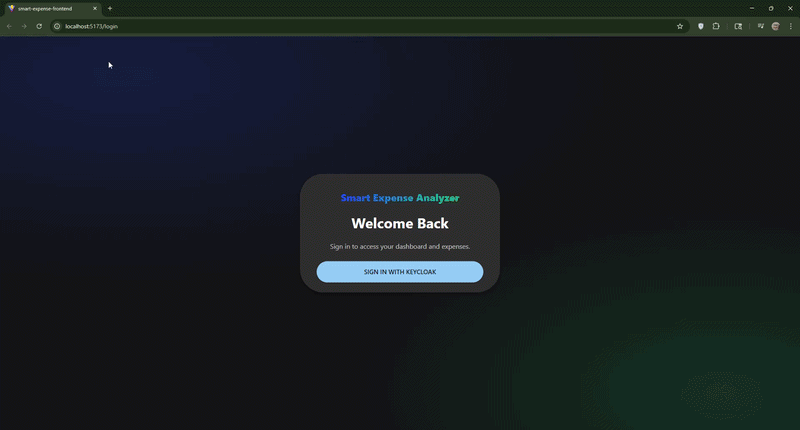
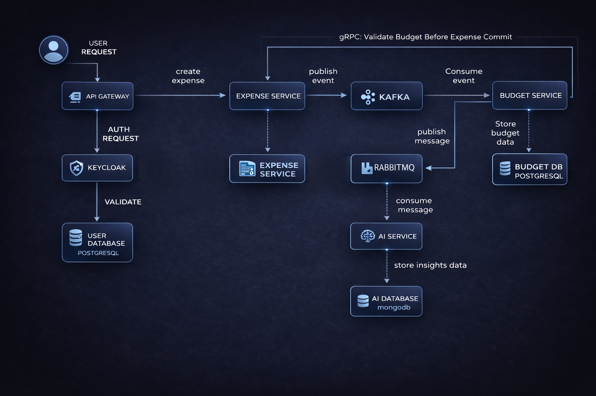

# Event-Driven-Budget-Platform



Distributed event-driven personal finance platform built with Spring Boot microservices. Uses Kafka for domain events, RabbitMQ for async notifications, Keycloak for JWT-based authentication, and integrates Google Gemini API to generate AI-powered financial insights and budget recommendations.

## Why This Project Matters

This project demonstrates:

- Microservices architecture with clear service boundaries
- Secure authentication and authorization with Keycloak + JWT
- Event-driven design using Kafka and RabbitMQ
- Mixed communication patterns (REST + gRPC + async messaging)
- Polyglot persistence (PostgreSQL + MongoDB)
- Resilience patterns and graceful fallbacks
- Dockerized microservices and infrastructure components for consistent local/dev environments

## System Flow

1. User logs in from the frontend through Keycloak.
2. API Gateway validates JWT and routes requests to backend services.
3. On first profile request, `user-service` auto-creates a user record if missing.
4. User creates an expense in `expense-service`.
5. `expense-service` calls `budget-service` via gRPC to get budget status/warning before saving.
6. Expense is saved to PostgreSQL and published to Kafka.
7. `budget-service` consumes the Kafka event, updates budget data in PostgreSQL, and publishes a budget event to RabbitMQ.
8. `ai-service` consumes the RabbitMQ event, generates insights, and stores them in MongoDB.
9. Frontend fetches budget and provides AI insight APIs for user-facing warnings and recommendations.

## Architecture


```text
Frontend (React + Vite)
  -> Keycloak Login
  -> API Gateway (Spring Cloud Gateway, JWT)

Gateway routes:
  /api/users/**    -> user-service
  /api/expenses/** -> expense-service
  /api/budgets/**  -> budget-service
  /api/insights/** -> ai-service

Event pipeline:
expense-service -> Kafka -> budget-service -> RabbitMQ -> ai-service
```

## Tech Stack

- Frontend: React, Vite, MUI, React Query, Keycloak JS
- Backend: Java 21, Spring Boot 4, Spring Security, Spring Data JPA
- API Gateway: Spring Cloud Gateway (WebFlux)
- Sync communication: REST, gRPC
- Async communication: Kafka, RabbitMQ
- Databases: PostgreSQL (user/expense/budget), MongoDB (AI insights)
- AI integration: Gemini API (with fallback behavior)
- Containerization: Docker (service-level containerization)

## Services

| Service | Port | Responsibility | Database |
|---|---:|---|---|
| api-gateway | 8080 | Auth + request routing | - |
| user-service | 4000 | User profile, get-or-create on first login | PostgreSQL |
| expense-service | 4001 | Expense CRUD, gRPC budget pre-check, Kafka producer | PostgreSQL |
| budget-service | 4002 (HTTP), 9001 (gRPC) | Budget logic, Kafka consumer, RabbitMQ producer | PostgreSQL |
| ai-service | 4003 | RabbitMQ consumer, AI insights API | MongoDB |
| smart-expense-frontend | 5173 (dev) | UI/dashboard | - |

## Example API

### Create Expense

`POST /api/expenses`

```json
{
  "userId": "11111111-1111-1111-1111-111111111111",
  "title": "Grocery Run",
  "description": "Weekly groceries",
  "amount": "86.45",
  "category": "FOOD",
  "expenseDate": "2026-02-18T18:30:00"
}
```

## Run with Docker

### Prerequisites

- Docker Desktop with Compose

Copy `.env.example` to `.env`, review the development-only credentials, and start the complete local stack from the repository root:

```bash
docker compose up -d --build
docker compose ps
```

Open the frontend at `http://localhost:5173`, Keycloak at `http://localhost:8181`, the gateway at `http://localhost:8080`, and RabbitMQ management at `http://localhost:15672`.

The default development user is `dev-user` with password `dev-only-keycloak-user-password`. These credentials are local-development fixtures only.

Useful commands:

```bash
docker compose logs -f api-gateway
docker compose build
docker compose down
```

## Validation

Each backend service can be tested and packaged from its own directory:

```bash
bash mvnw -B clean verify
```

The budget service also has one Docker-backed PostgreSQL integration test for
the PostgreSQL-specific inbox `ON CONFLICT` idempotency boundary:

```bash
cd budget-service
bash mvnw -B -Pintegration-tests -Dtest=InboxEventRepositoryIT test
```

Frontend validation runs from `smart-expense-frontend`:

```bash
npm ci
npm test
npm run lint
npm run build
```

GitHub Actions runs the backend clean builds, the isolated PostgreSQL test,
frontend validation, and `docker compose config --quiet`. CI does not start
Kafka, RabbitMQ, MongoDB, Keycloak, or Gemini, and ordinary tests do not
require a Gemini credential.

## Health endpoints

Backend services expose only these unauthenticated health probes:

- `/actuator/health`
- `/actuator/health/liveness`
- `/actuator/health/readiness`

Health details remain hidden. PostgreSQL is readiness-critical for the
database-backed services. Kafka and RabbitMQ health remains observable without
making expense or budget business operations unready while their outboxes can
retain work safely. AI readiness includes MongoDB and RabbitMQ because RabbitMQ
is required for its command-consumer role. Gemini credentials are intentionally
not part of startup or readiness.

The platform retains at-least-once messaging semantics: Kafka, RabbitMQ, and
the associated inbox/outbox recovery paths do not claim exactly-once delivery.

### Containerized Components

- api-gateway
- user-service
- expense-service
- budget-service
- ai-service
- Keycloak
- Kafka
- RabbitMQ
- PostgreSQL
- MongoDB

The backend services use internal Compose DNS names for PostgreSQL, MongoDB, Kafka, RabbitMQ, and Keycloak. Only the frontend, gateway, Keycloak, and RabbitMQ management UI are exposed to the host.

## Environment Variables

- `SPRING_DATASOURCE_URL`
- `SPRING_DATASOURCE_USERNAME`
- `SPRING_DATASOURCE_PASSWORD`
- `SPRING_KAFKA_BOOTSTRAP_SERVERS`
- `SPRING_DATA_MONGODB_URI`
- `KEYCLOAK_ISSUER_URI`
- `KEYCLOAK_JWK_SET_URI`
- `RABBITMQ_QUEUE_NAME`
- `RABBITMQ_EXCHANGE_NAME`
- `GEMINI_API_KEY` 

## License

Copyright © 2026 Ali Akcin.

This project is published for portfolio purposes only.  
Unauthorized copying, redistribution, or commercial use of this codebase is prohibited without prior written consent.
